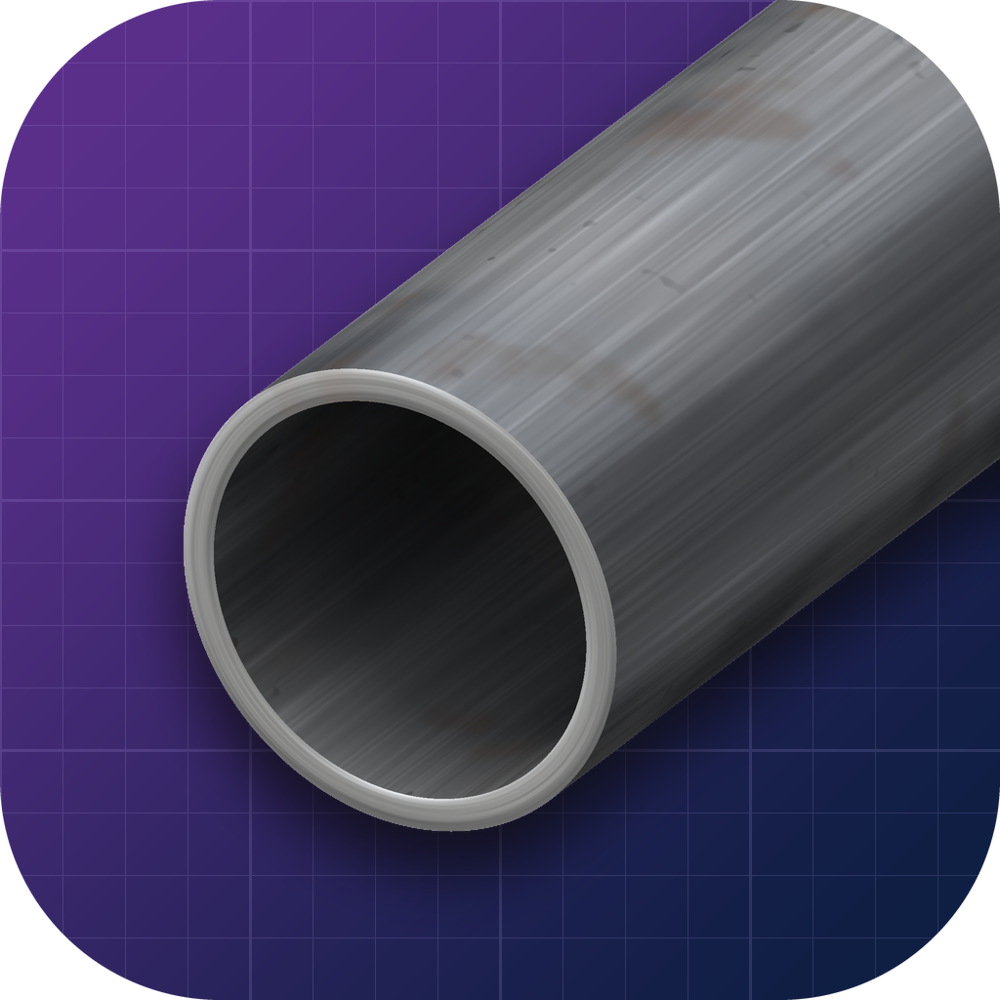
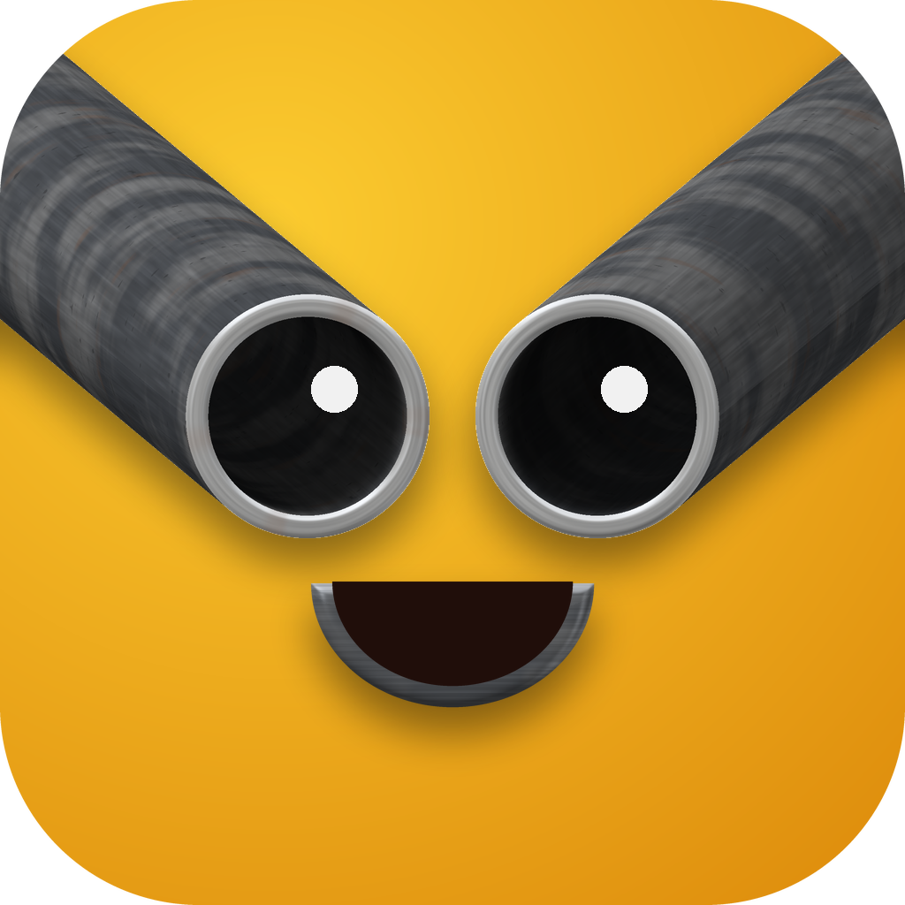

# Metal Pipe Org Media Kit

Logos and icons of Metal Pipe Org. Each brand has one ready-to-use icon in the root of this repository.
Everything else (other sizes, shapes and parts) lives under `variants/`.

## Icons

| MetalPipeOrg | Metal Community |
| :---: | :---: |
|  |  |
| [`metalpipeorg.png`](metalpipeorg.png) | [`metal-community.png`](metal-community.png) |

Each root file is 1024 × 1024 px with rounded corners and a transparent outside. It is the right choice
for most uses.

App icons, such as the [Metal Planner](https://github.com/Metal-Pipe-Org/Metal-Planner) one, are not
kept here. Each app's icon lives in that app's own repository, so there is only ever one copy to update.

## Variants

Each brand's variants are in its own folder: [`variants/metalpipeorg/`](variants/metalpipeorg) and
[`variants/metal-community/`](variants/metal-community).

1. `rounded/`: the root icon in 1024, 512, 256, 192, 180, 128, 64, 32 and 16 px. 180 px is the size iOS
   uses for home screen icons, 192 px the size Android uses.
2. `square/`: the icon without rounded corners, in 1024, 512 and 256 px. Use it for avatars on GitHub,
   Discord, Slack and other sites that crop the image into their own shape.
3. `transparent/`: the artwork alone on a transparent background, for placing over your own backgrounds.
   For MetalPipeOrg that is the pipe, for Metal Community the face.
4. `background/` (MetalPipeOrg only): the purple and navy blueprint grid alone, for banners and slides.
5. `favicon.ico`: a website favicon with 16, 32 and 48 px versions inside.

## History

Every idea proposed while designing these icons, including the rejected ones, is kept in
[`history/`](history/README.md).

## Rebuilding

Every image is rendered by a script. See [`source/README.md`](source/README.md) for how to change and
rebuild them.

## Rights

© 2026 Metal Pipe Org. All rights reserved.
