# Metal Community icon history

Every proposal made on the way to the Metal Community icon, in the order they were made. Numbering continues from the MetalPipeOrg history. 71 was chosen.

## Round 1: groups of pipes

The org icon's steel and background, turned into groups of pipes. Rejected as too close to the org icon.

| 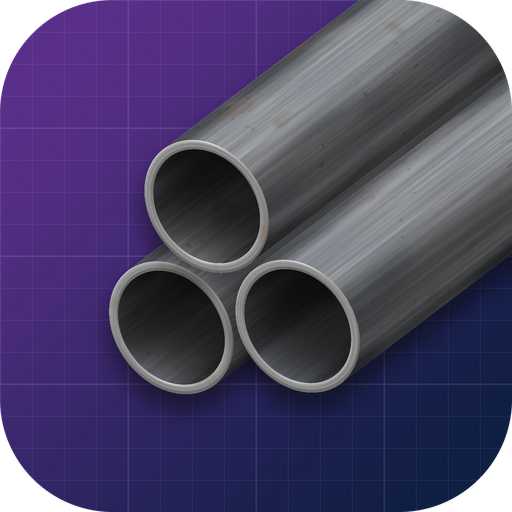 | 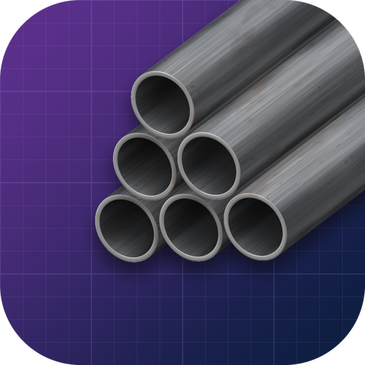 | 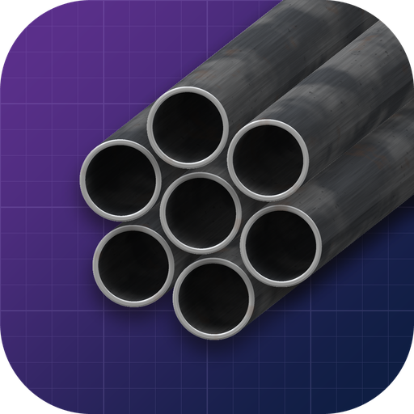 | 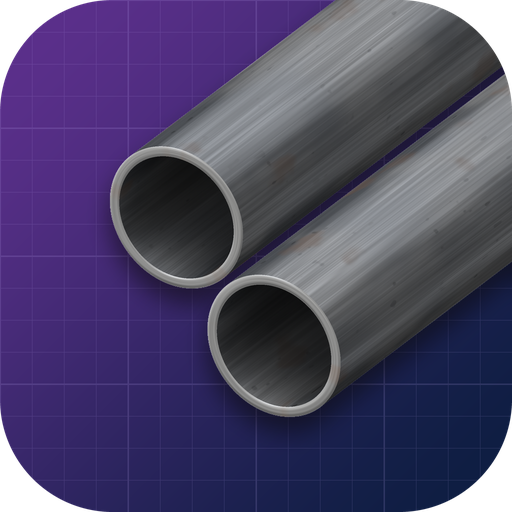 |
| :---: | :---: | :---: | :---: |
| **49. Bundle of three** Three pipes tied together. | **50. Stack** Six pipes stacked 3-2-1. | **51. Honeycomb** Seven pipes in a hex bundle, almost end-on. | **52. Pair** Two pipes side by side. |

| 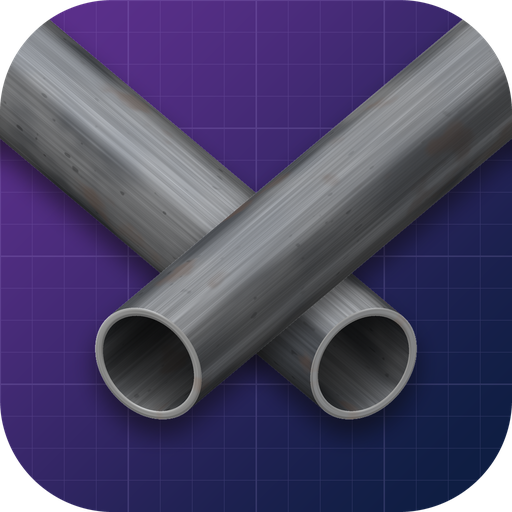 | 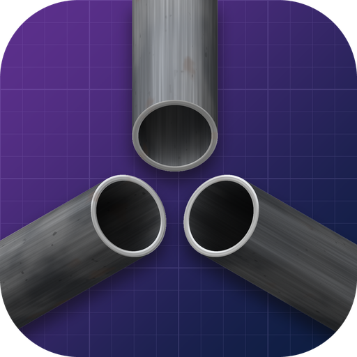 | 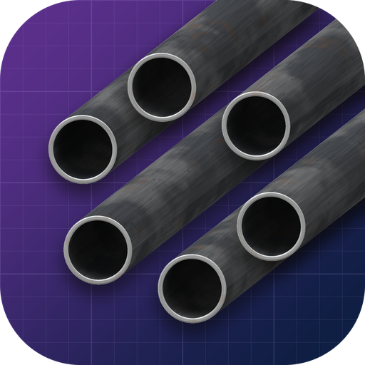 | 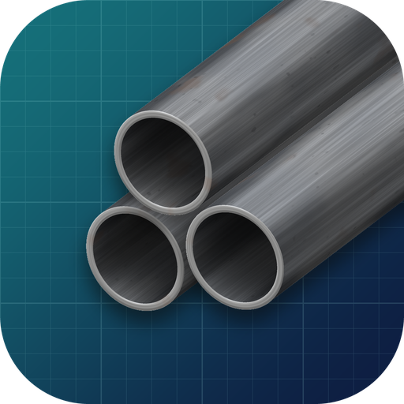 |
| :---: | :---: | :---: | :---: |
| **53. Crossing** Two pipes laid across each other. | **54. Meeting point** Three pipes coming in from different sides. | **55. Circle** Six pipes in a ring. | **56. Bundle of three, teal** 49 on a teal blueprint. |

| 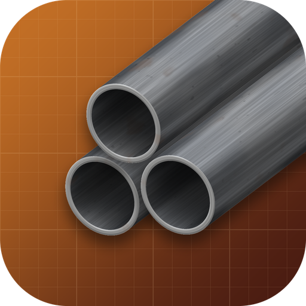 | 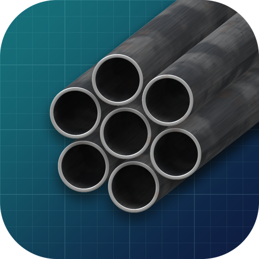 |
| :---: | :---: |
| **57. Bundle of three, amber** 49 on an amber and rust blueprint. | **58. Honeycomb, teal** 51 on the teal blueprint. |

## Round 2: clearly different

New shapes, colours and styles, so the community icon is never mistaken for the org one. 64 was liked and led to round 3.

| 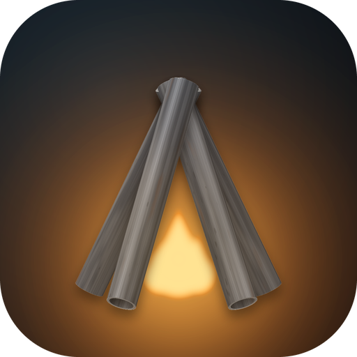 | 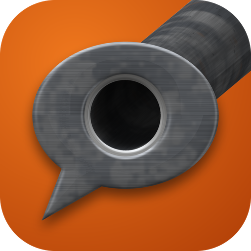 |  | 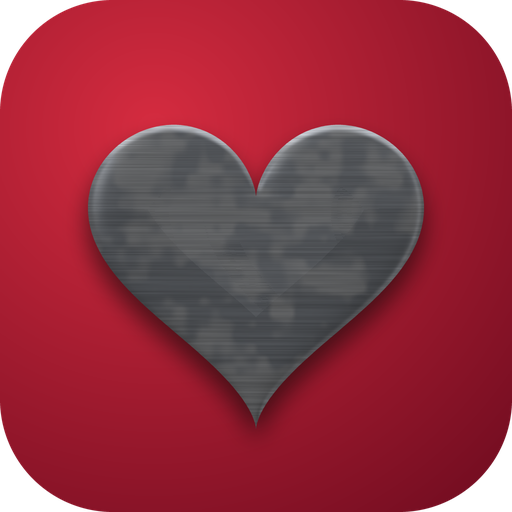 |
| :---: | :---: | :---: | :---: |
| **59. Campfire** Pipes leaning together over a fire. | **60. Speech bubble** A steel speech bubble with a pipe pushed through it. | **61. People** The "group of people" symbol stamped in steel. | **62. Heart** A stamped steel heart. |

|  |  | 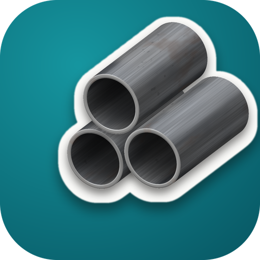 |  |
| :---: | :---: | :---: | :---: |
| **63. MC monogram** The letters MC in heavy stamped steel. | **64. Pipe buddy** Two pipe ends as eyes and a steel smile. | **65. Sticker** A bundle of three pipes as a die-cut sticker. | **66. Ring** A heavy steel ring. |

## Round 3: pipe buddy

Variations of the pipe buddy mascot. 71 became the Metal Community icon.

|  |  | 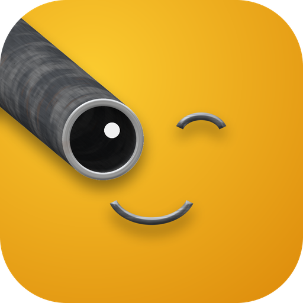 | 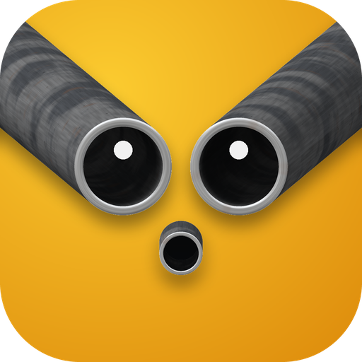 |
| :---: | :---: | :---: | :---: |
| **67. Straight on** The pipes face the viewer, so only the round ends show. | **68. Curious** Raised steel eyebrows, eyes looking up. | **69. Wink** One pipe eye, one closed eye, wide smile. | **70. Surprised** The mouth is a third, smaller pipe end. |

|  |  |  |  |
| :---: | :---: | :---: | :---: |
| **71. Big grin (chosen)** A wide open mouth with a steel rim. The Metal Community icon. | **72. Determined** Angled steel eyebrows and a flat mouth. | **73. Cyclops** One big pipe eye. | **74. Crew** Three small buddies together. |

| 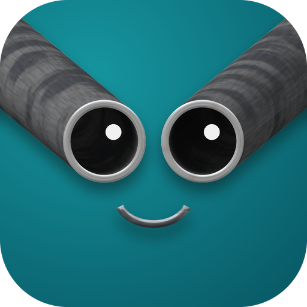 | 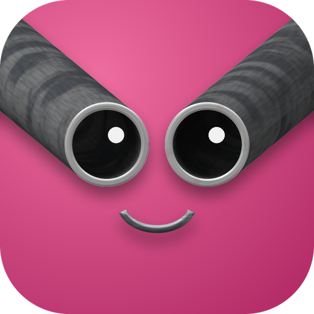 | 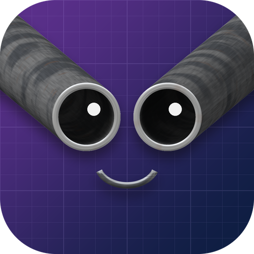 |  |
| :---: | :---: | :---: | :---: |
| **75. Teal** 64 on teal. | **76. Pink** 64 on pink. | **77. Org blueprint** 64 on the MetalPipeOrg background. | **78. Orange** 64 on orange. |
