# MetalPipeOrg icon history

Every proposal made on the way to the MetalPipeOrg icon, in the order they were made. Numbers are the ones used while choosing. 48 was chosen.

## Round 1: vector drawings

Flat vector icons of a metal pipe, drawn by hand in SVG. Rejected as too "vector-looking"; 2 and 7 were liked and led to round 2.

| 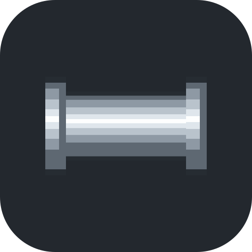 |  | 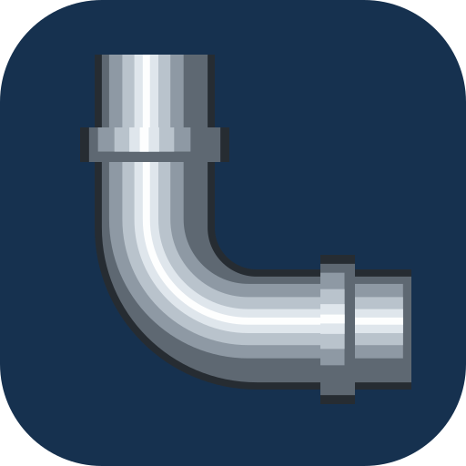 | 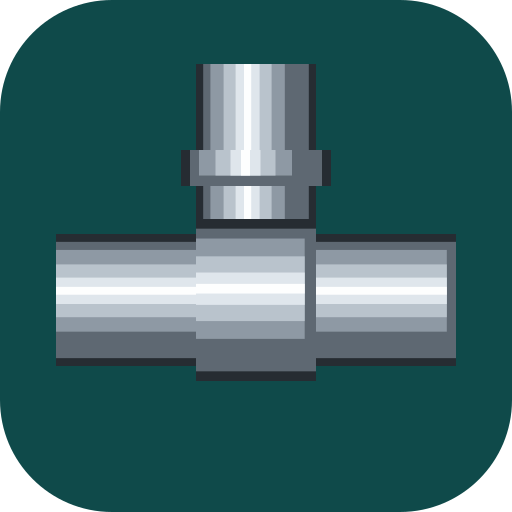 |
| :---: | :---: | :---: | :---: |
| **1. Pipe section** A classic pipe section with flanges on both ends. | **2. Outlet** The pipe seen end-on: a metal ring around a dark hole. | **3. Elbow** A pipe bent at a right angle, with two clamps. | **4. Tee** A T-shaped fitting where three ways meet. |

|  | 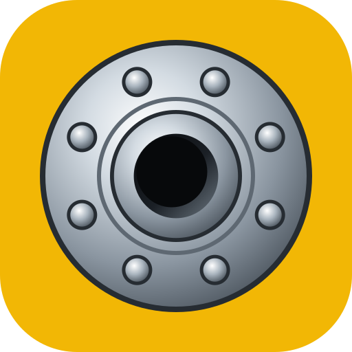 | 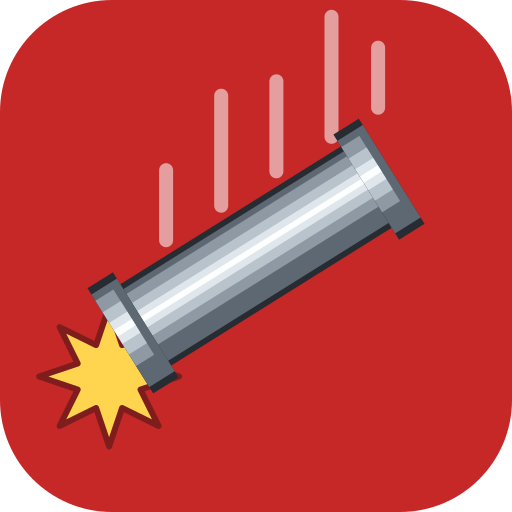 | 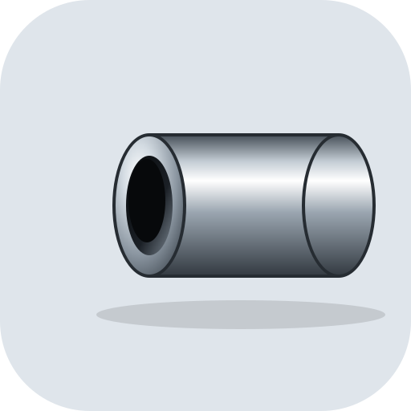 |
| :---: | :---: | :---: | :---: |
| **5. Letter M** One pipe bent into the letter M, with flanges at the base. | **6. Flange** A flange plate with bolts around it, seen face-on. | **7. Falling pipe** A nod to the falling metal pipe meme: the pipe mid-air, hitting the ground. | **8. Pipe in perspective** A cylinder seen at an angle, with the opening visible. |

| 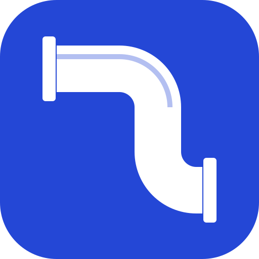 | 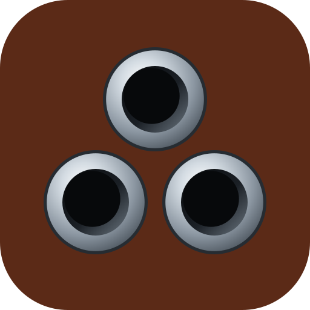 | 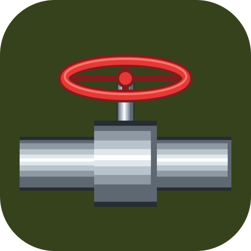 | 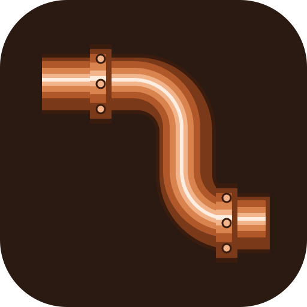 |
| :---: | :---: | :---: | :---: |
| **9. Flat line** A pipe drawn in one colour with no shading. | **10. Pipe bundle** Three pipes seen end-on, grouped together. | **11. Valve** A pipe with a valve and a red handwheel. | **12. Copper with rivets** A copper pipe with riveted clamps, steampunk style. |

| 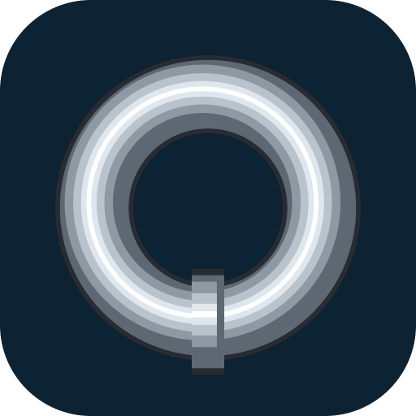 | 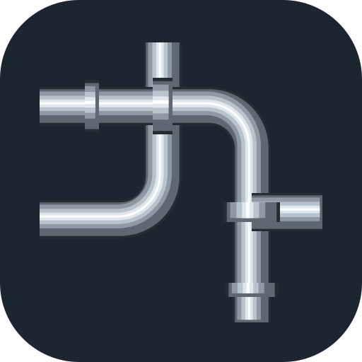 |  |
| :---: | :---: | :---: |
| **13. Ring** A pipe closed into a ring, with one clamp. | **14. Pipe network** Several thinner pipes with elbows and a crossing, like a plumbing diagram. | **15. Nut** A hexagonal nut with a thread inside. |

## Round 2: 3D renders

Proposals 2 and 7 redone as 3D renders of a raw steel pipe, after a reference photo of a black steel tube.

| 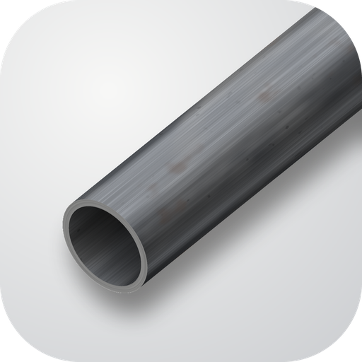 | 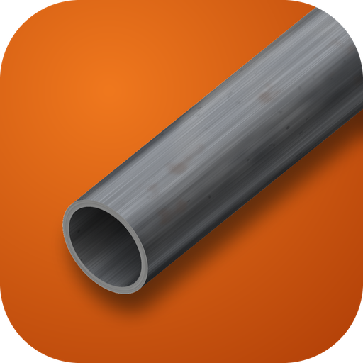 | 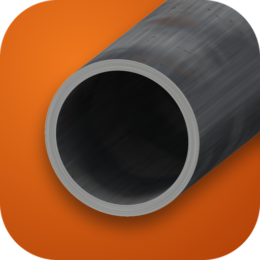 | 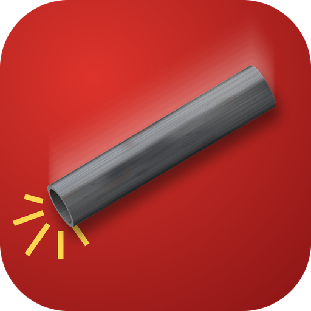 |
| :---: | :---: | :---: | :---: |
| **16. Outlet like the photo** The pipe at an angle, open end towards the viewer, on a light studio background. | **17. Outlet on orange** The same pipe on the orange background of proposal 2. | **18. Outlet face-on** Proposal 2 as a 3D render: a thicker cut and a dark inside. | **19. Falling pipe, rendered** Proposal 7 with a realistic pipe, a motion trail and an impact flash. |

| 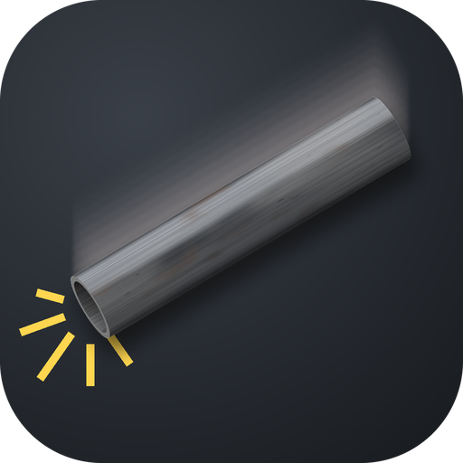 |
| :---: |
| **20. Falling pipe on graphite** The same falling pipe on a dark background. |

## Round 3: around 18

Variations of proposal 18, the outlet seen from the front, with a rounded cut edge.

| 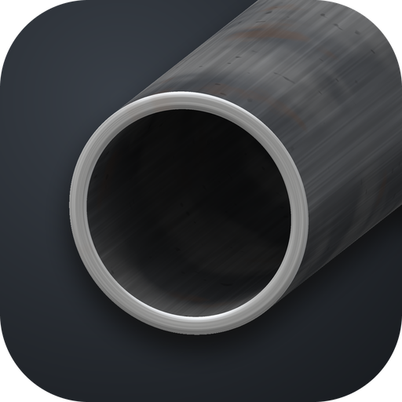 | 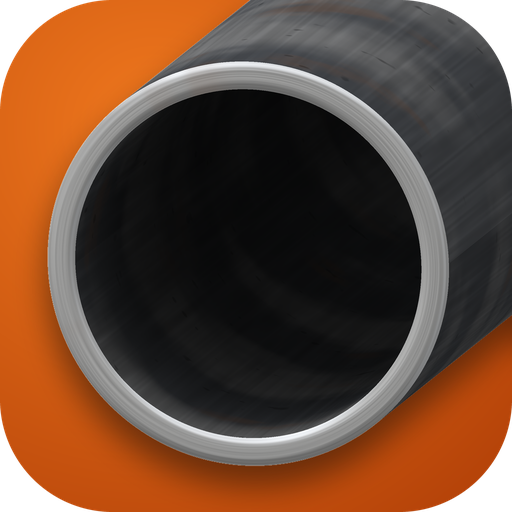 | 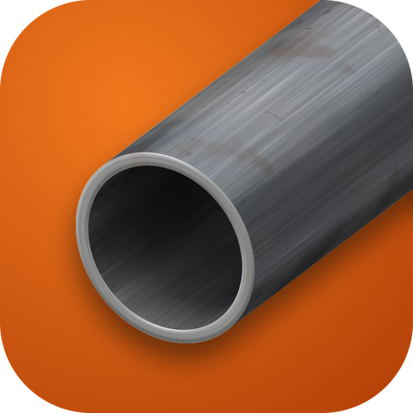 | 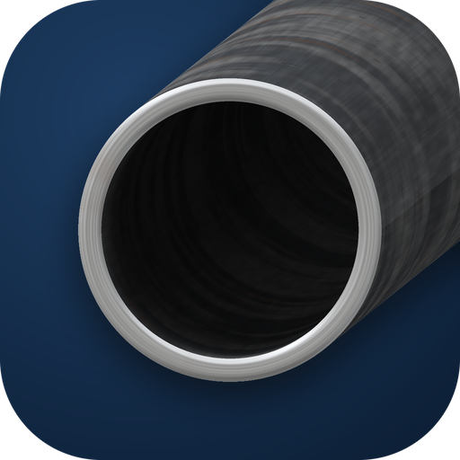 |
| :---: | :---: | :---: | :---: |
| **21. Graphite** Like 18, on a dark background. | **22. Tight crop** The outlet fills almost the whole icon. | **23. Steeper angle** More of the side shows, less of the opening. | **24. Almost straight on** Looking almost straight into the pipe. Navy background. |

| 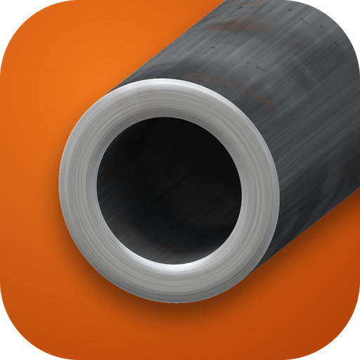 |  | 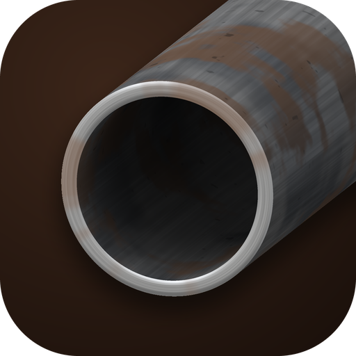 | 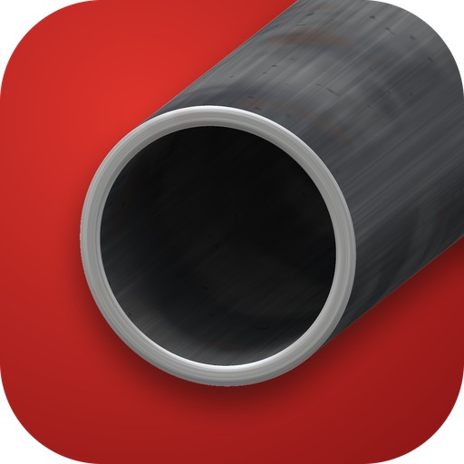 |
| :---: | :---: | :---: | :---: |
| **25. Thick wall** A thick-walled pipe with a wide, bright cut edge. | **26. Light at the end** A short pipe with warm light showing through from the far end. | **27. Rusty** The same pipe, heavily corroded, on brown. | **28. Red** Like 18, in the red of proposal 7. |

## Round 4: backgrounds for 23

The pipe from proposal 23 on twelve different backgrounds.

| 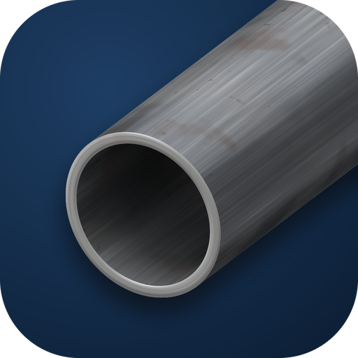 | 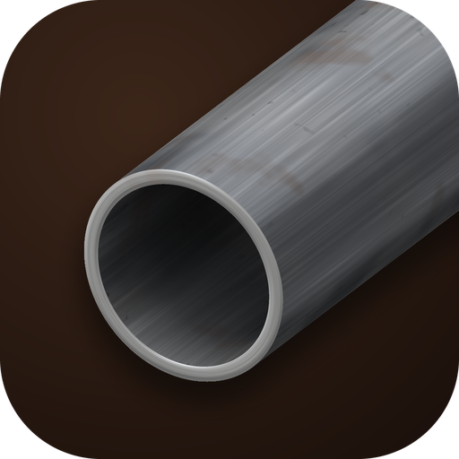 | 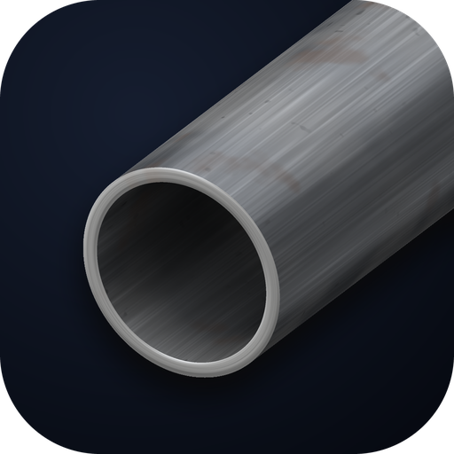 | 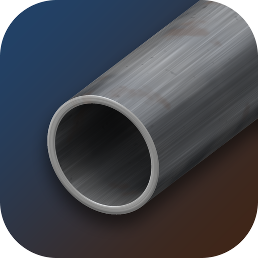 |
| :---: | :---: | :---: | :---: |
| **29. Navy** The background of 24. | **30. Brown** The background of 27. | **31. Midnight navy** Almost black navy. | **32. Navy to brown** A diagonal blend of the two backgrounds liked so far. |

| 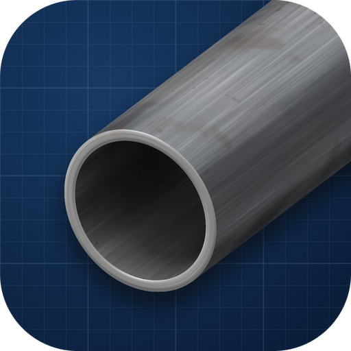 | 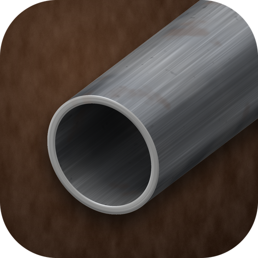 | 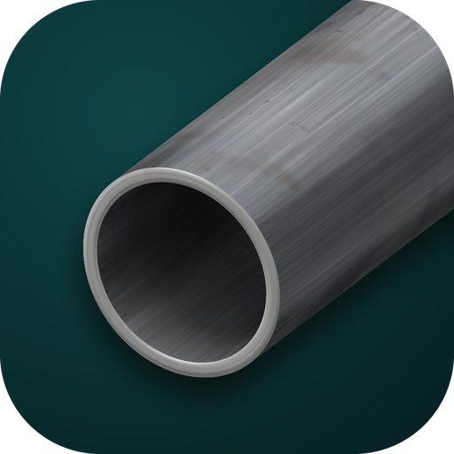 | 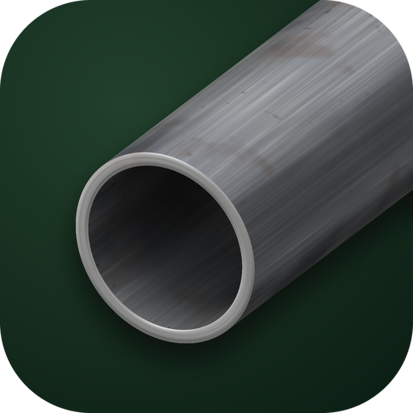 |
| :---: | :---: | :---: | :---: |
| **33. Blueprint** Navy with a faint technical drawing grid. | **34. Rust texture** Brown with the texture of rusty sheet metal. | **35. Sea** Dark teal. | **36. Bottle green** Dark industrial green. |

| 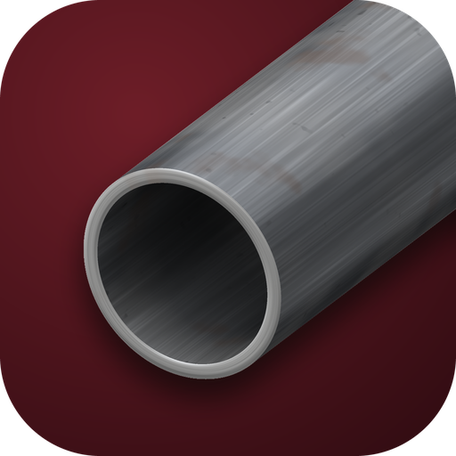 | 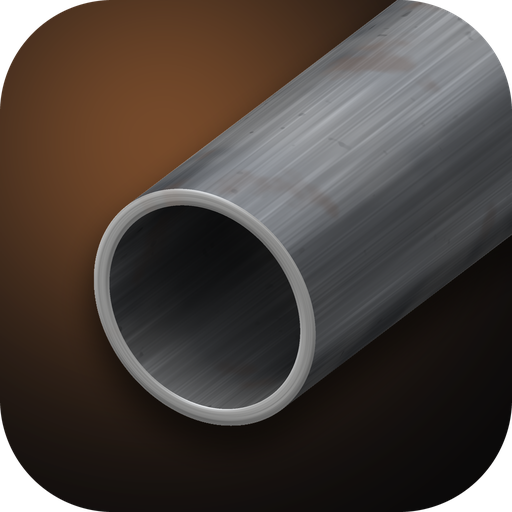 | 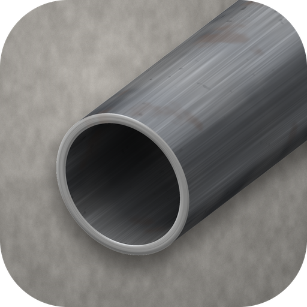 | 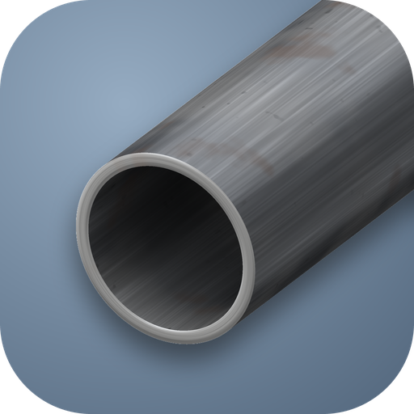 |
| :---: | :---: | :---: | :---: |
| **37. Burgundy** Dark wine red. | **38. Workshop** Almost black, with a warm patch of lamplight in the corner. | **39. Concrete** Light grey concrete texture. | **40. Steel blue** Light, cool blue-grey. |

## Round 5: purples

The pipe from proposal 23 on purple backgrounds, plain and with a blueprint grid. 48 became the MetalPipeOrg icon.

| 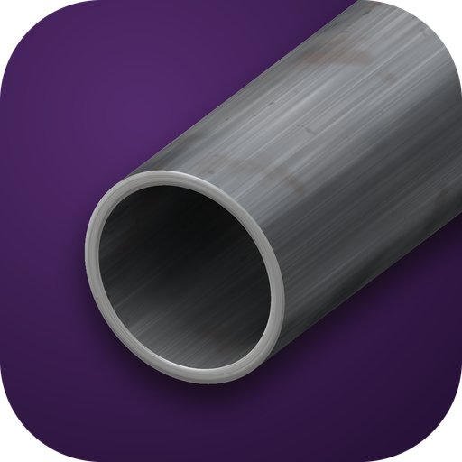 | 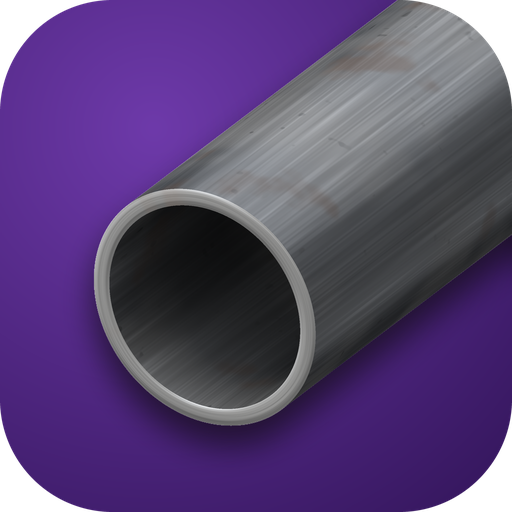 | 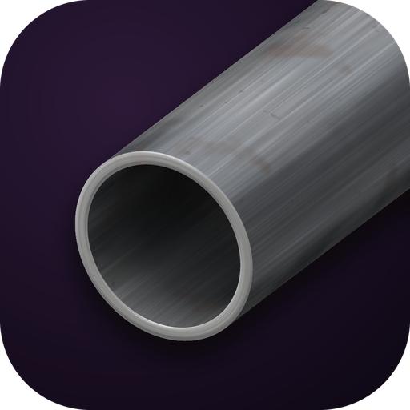 |  |
| :---: | :---: | :---: | :---: |
| **41. Plum** Dark, muted purple. | **42. Royal purple** Brighter and more saturated. | **43. Aubergine** Almost black purple. | **44. Purple to navy** A diagonal blend from purple to navy. |

| 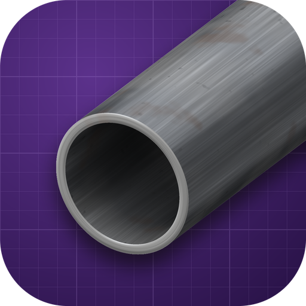 |  | 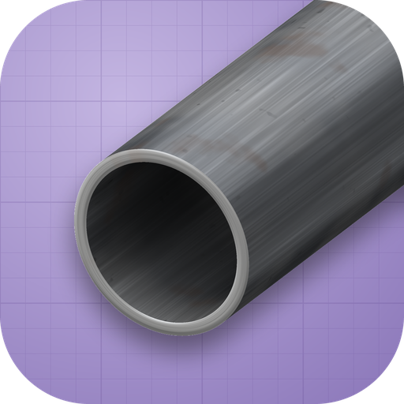 | 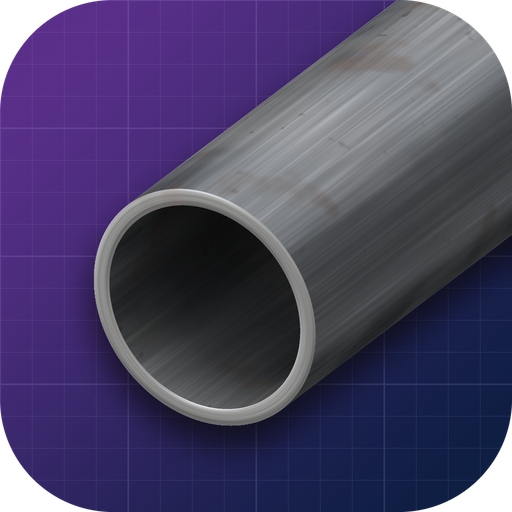 |
| :---: | :---: | :---: | :---: |
| **45. Purple blueprint** A blueprint grid on purple. | **46. Aubergine blueprint** A calmer grid on almost black purple. | **47. Lavender blueprint** Light lavender with a darker grid, like graph paper. | **48. Purple to navy blueprint (chosen)** A blueprint grid on the purple to navy blend. The MetalPipeOrg icon. |
